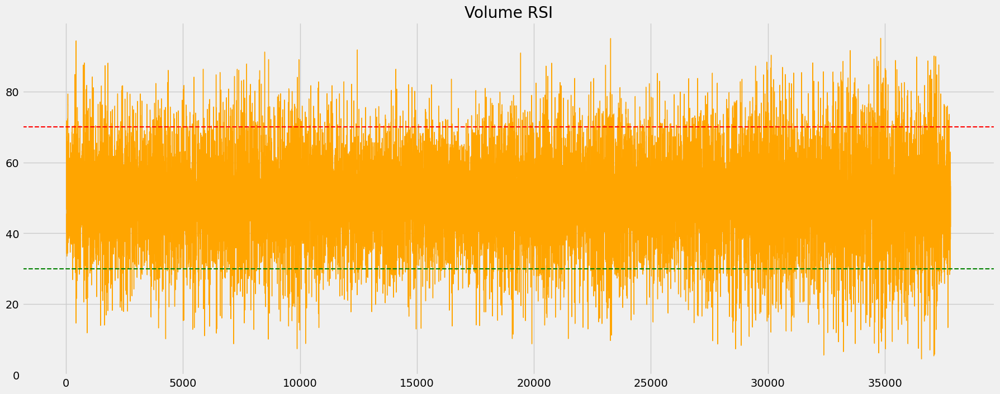
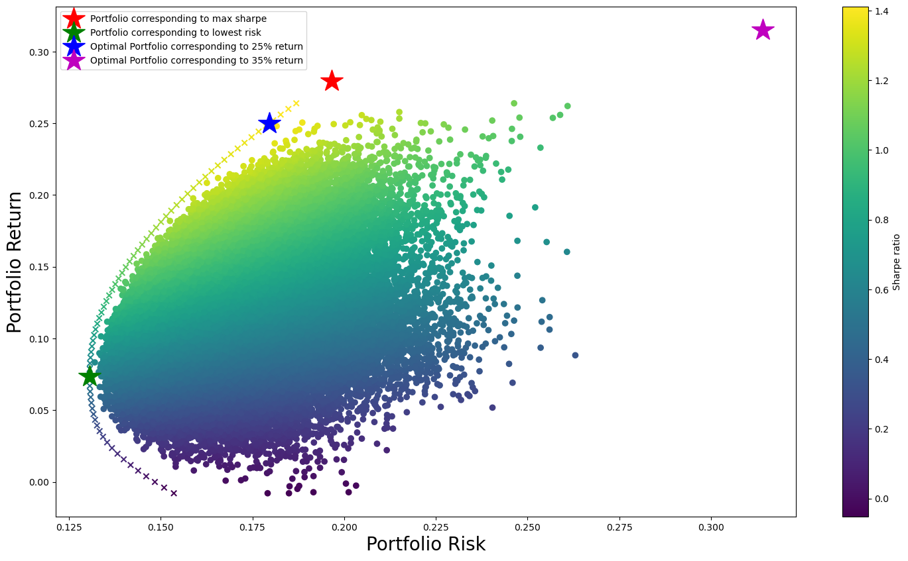
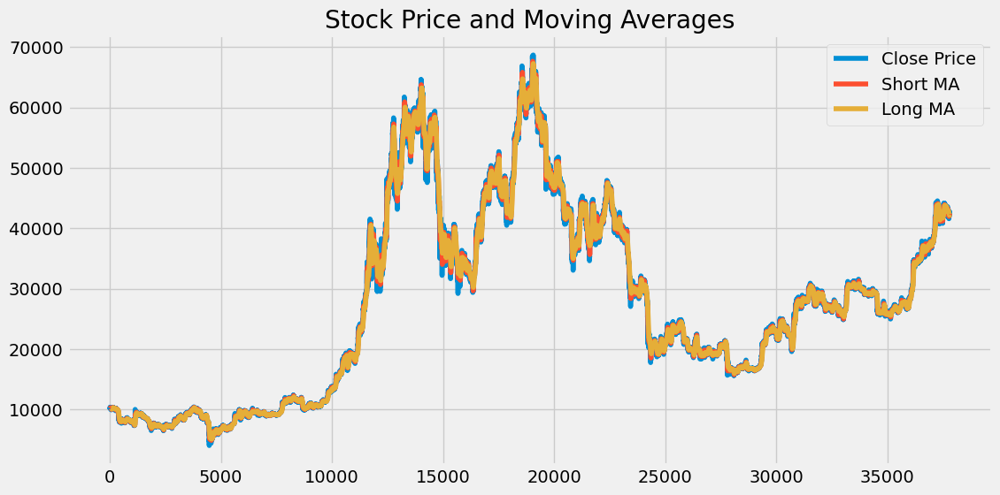
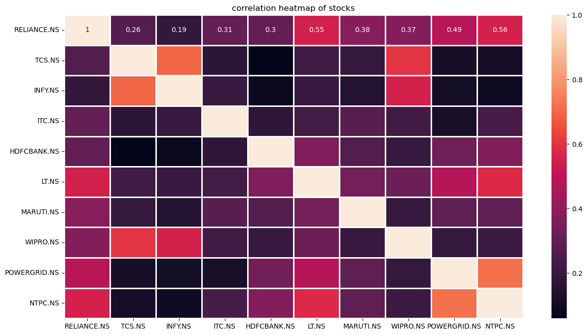

# Portfolio Risk Management

A quantitative finance project exploring **technical analysis**, **Modern Portfolio Theory (MPT)** and **systematic trading strategy backtesting** using Python. This repository demonstrates the complete workflow of developing investment strategies from market data acquisition and indicator engineering to portfolio optimization and historical performance evaluation.

---

## Project Overview

This project implements several key concepts used in quantitative finance and portfolio management:

- Historical market data acquisition and preprocessing
- Technical indicator computation
- Mean-Variance Portfolio Optimization (Modern Portfolio Theory)
- Rule-based trading strategy development
- Historical backtesting and performance evaluation
- Candlestick pattern detection and visualization

The objective is to combine classical portfolio theory with technical analysis techniques to evaluate investment decisions using historical market data.

---

# Features

## Technical Indicator Analysis

Implemented commonly used momentum and trend-following indicators including:

- Moving Average Convergence Divergence (MACD)
- Signal Line
- Volume RSI
- Average True Range (ATR)
- Moving Averages
- Trend Visualization

---

<p align="center">

</p>

---

## Modern Portfolio Optimization

Implemented Markowitz Mean-Variance Optimization to construct efficient portfolios using historical asset returns.

The notebook includes:

- Historical stock price collection
- Daily return computation
- Covariance matrix estimation
- Portfolio return and risk calculation
- Efficient portfolio construction

---

<p align="center">

</p>

---

## Trading Strategy Backtesting

Developed a rule based systematic trading strategy combining multiple technical indicators.

The strategy incorporates:

- MACD crossover signals
- Moving Average confirmation
- Volume RSI filtering
- ATR based risk consideration
- Historical trade simulation

Performance metrics are computed using historical market data to evaluate strategy robustness.

---

<p align="center">

</p>

---

## Portfolio Performance Analysis

Analyzed portfolio-level performance using historical returns and evaluated various investment characteristics including:

- Portfolio return
- Portfolio volatility
- Risk-adjusted performance
- Comparative analysis

---

<p align="center">

</p>

---

## Candlestick Pattern Detection

Implemented automated identification of bullish candlestick formations including:

- Hammer Detection
- Candlestick Visualization
- Pattern Highlighting

using **mplfinance** for financial chart visualization.

---

<p align="center">

</p>

---

# Results

The project demonstrates how quantitative techniques can be combined to support systematic investment decisions by:

- Extracting actionable signals from technical indicators.
- Constructing diversified portfolios using Modern Portfolio Theory.
- Evaluating trading strategies through historical backtesting.
- Identifying candlestick reversal patterns for additional market insights.

---

## Repository Structure

```text
Portfolio-Risk-Management/
│
├── notebooks/
│   ├── technical_indicator_analysis.ipynb
│   ├── modern_portfolio_optimization.ipynb
│   ├── strategy_backtesting.ipynb
│   ├── portfolio_performance_analysis.ipynb
│   └── candlestick_pattern_detection.ipynb
│
├── assets/
│   └── images/
|       ├── backtesting.png
│       ├── candlestick-detection.png
│       ├── efficient-frontier.png
│       ├── technical-indicators.png
│       └── portfolio-analysis.png
│
├── README.md
└── requirements.txt
```
